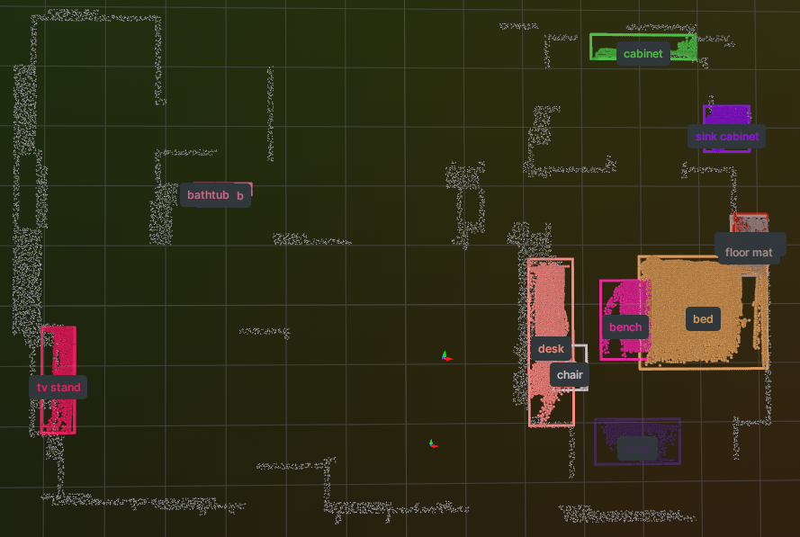

# README.md

## 一. 项目作用
这个是search_only分支，这个分支主要是用来做搜索的，所以可以加载之前保存好的建图部分的构建结果，
并且运行一个rerun的窗口，rerun窗口中包含了之前保存的所有物体和layout


## 二. 加载结果
#### 2.1 理论上的加载结果



## 三. 安装

> 已在 **Ubuntu 22.04** + **ROS 2 Humble** + **Python 3.10** 上测试通过

#### 3.1 克隆仓库（包含子模块）

```bash
git clone --branch feat/search_only --single-branch --recurse-submodules git@github.com:Tipriest/DualMap.git
cd DualMap
```


#### 3.2 创建 Conda 环境
```bash
conda env create -f environment.yml
conda activate dualmap

# 针对特定情况
conda install openssl=3.0.13  # Ubuntu 22.04 常用版本
conda install libcurl
```

#### 3.3 安装 MobileCLIP(以后可以安装clip v2)
```bash
cd 3rdparty/mobileclip
pip install -e . --no-deps
cd ../..
```


## 四. 数据集设置

在运行工具之前，请按照 [数据集设置指南](docs/dataset_netdisk.md) 准备所需的数据集。

## 五. 其他事项
1. [与vln_gazebo_simulator的坐标转换问题说明](./docs/坐标转换.md)
## 运行
```bash
conda activate dualmap
python -m applications.runner_ros
```