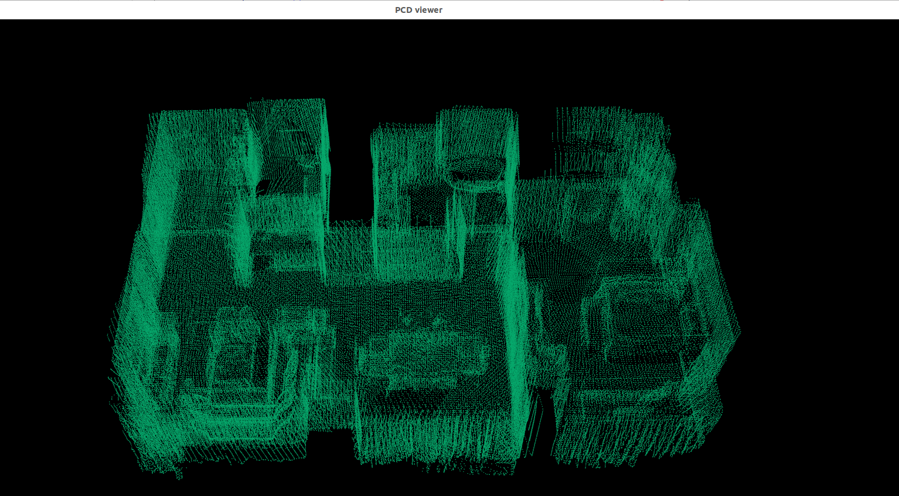
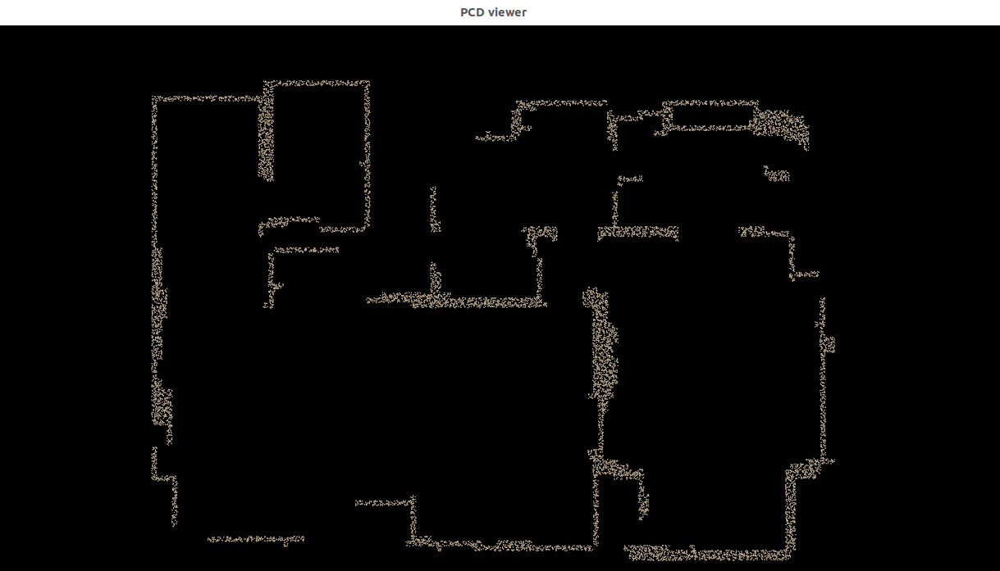

# README.md

## 一. 项目作用
作为`语义地图`/`层次关系图`加载和构建的验证平台
- 输入
  - ROS实时数据流
    - RGB-D消息
    - 机器人位置Pose
    - 相机内参
  - 数据集
    - 数据集
- 输出
  - 地图数据流
    - 语义地图对象列表
    - 语义地图层次关系
- 生成文件
  - layout点云布局
  - 
  - 语义地图对象列表
  - 所有类别物体的数量(class_num.json)
- 验证
  - 生成地图之后使用脚本，判断检测率和位置平均检测偏差，最好能够在一张图上打印出来，或者在多张图上打印出来
  - 
  - 生成之后查看生成的树状关系图，最好能够用某种方式展示出来，可以用节点拉伸打开这样子
  - 生成之后查看
- 需要负责的任务
  - YOLO扩展与增训
  - 检测准确度排查
  - 分层的层次地图


## 构建结果
#### 1. layout.pcd文件

#### 2. wall.pcd文件



## 安装

> 已在 **Ubuntu 22.04** + **ROS 2 Humble** + **Python 3.10** 上测试通过

#### 1. 克隆仓库（包含子模块）

```bash
git clone --branch main --single-branch --recurse-submodules git@github.com:Tipriest/DualMap.git
cd DualMap
```


#### 2. 创建 Conda 环境
```bash
conda env create -f environment.yml
conda activate dualmap

# 针对特定情况
conda install openssl=3.0.13  # Ubuntu 22.04 常用版本
conda install libcurl
```

#### 3. 安装 MobileCLIP(以后可以安装clip v2)
```bash
cd 3rdparty/mobileclip
pip install -e . --no-deps
cd ../..
```

## 应用

以下是每种应用类型的需求快速概览：

| 应用 | Conda 环境  | ROS2 | Habitat Data Collector |
| :--- | :---: | :---: | :---: |
| 数据集 / 查询 / iPhone | ✓  | | |
| ROS（离线/在线） | ✓ | ✓ | |
| 在线仿真（建图+导航） | ✓ | ✓ | ✓ |


### 💾 使用数据集运行

DualMap 支持使用**离线数据集**运行。当前支持的数据集包括：
1. Replica 数据集  
2. ScanNet 数据集  
3. TUM RGB-D 数据集  
4. 使用 [Habitat Data Collector](https://github.com/Eku127/habitat-data-collector) 自行采集的数据  

对于从您自己的平台采集的数据，您可以按类似格式组织以运行系统。

遵循[数据集运行指南](resources/doc/app_runner_dataset.md)来安排数据集、使用这些数据集运行 DualMap 并复现我们论文**表 II** 中的离线建图结果。

### 🤖 使用 ROS 运行

DualMap 支持来自 **ROS1** 和 **ROS2** 的输入。您可以使用**离线 rosbags** 或在真实机器人上以**在线模式**运行系统。

遵循 [ROS 运行指南](resources/doc/app_runner_ros.md)开始使用 ROS1/ROS2 rosbags 或实时 ROS 数据流运行 DualMap。

### 🕹️ 仿真中的在线建图与导航

DualMap 通过 [Habitat Data Collector](https://github.com/Eku127/habitat-data-collector) 支持仿真中的**在线**交互式建图和物体导航。

遵循[在线建图与导航指南](resources/doc/app_simulation.md)开始在交互式仿真场景中运行 DualMap，并复现我们论文**表 III** 中的导航结果（静态和动态）。

### 📱 使用 iPhone 运行

DualMap 支持从 iPhone 上的 **Record3D** 应用进行**实时数据流传输**。

遵循 [iPhone 运行指南](resources/doc/app_runner_record_3d.md)开始设置 Record3D、将数据流传输到 DualMap，并使用您自己的 iPhone 进行建图！

### 🔍 离线地图查询

我们提供了两个预构建的地图示例用于离线查询：一个来自 iPhone 数据，另一个来自 Replica Room 0。

遵循[离线查询指南](resources/doc/app_offline_query.md)运行查询应用。

### 🖼️ 可视化
<p align="center">
    
</p>

系统同时支持 [Rerun](https://rerun.io) 和 [Rviz](http://wiki.ros.org/rviz) 可视化。使用 ROS 运行时，您可以通过 `config/runner_ros.yaml` 中的 `use_rerun` 和 `use_rviz` 选项切换可视化方式。

## 引用

如果您觉得我们的工作有帮助，请考虑为本仓库点星 🌟 并引用：

```bibtex
@article{jiang2025dualmap,
  title={DualMap: Online Open-Vocabulary Semantic Mapping for Natural Language Navigation in Dynamic Changing Scenes},
  author={Jiang, Jiajun and Zhu, Yiming and Wu, Zirui and Song, Jie},
  journal={arXiv preprint arXiv:2506.01950},
  year={2025}
}
```

## 联系方式
技术问题请创建 issue。其他问题请联系第一作者：jjiang127 [at] connect.hkust-gz.edu.cn

## 致谢

我们感谢 [HOVSG](https://github.com/hovsg/HOV-SG) 和 [ConceptGraphs](https://github.com/concept-graphs/concept-graphs) 作者的贡献和启发。

特别感谢 @[TOM-Huang](https://github.com/Tom-Huang) 在整个项目开发过程中提供的宝贵建议和支持。

我们也感谢 [MobileCLIP](https://github.com/apple/ml-mobileclip)、[CLIP](https://github.com/openai/CLIP)、[Segment Anything (SAM)](https://github.com/facebookresearch/segment-anything)、[MobileSAM](https://github.com/ChaoningZhang/MobileSAM)、[FastSAM](https://github.com/CASIA-IVA-Lab/FastSAM) 和 [YOLO-World](https://github.com/AILab-CVC/YOLO-World) 的开发者们提供的优秀开源工作，为本项目提供了强大的技术基础。
