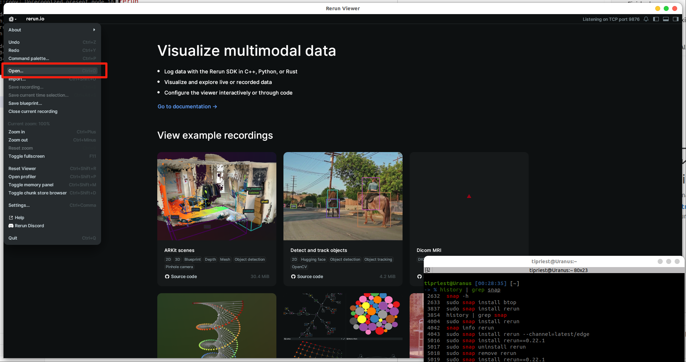

# README.md
rerun使用的是0.22.1的版本

## rerun sdk 安装方法
```shell
snap info rerun
```
然后能看到现在能够安转的`rerun`版本:
```txt
channels:
  latest/stable:    0.27.2 2025-12-11 (23) 36MB -
  latest/candidate: 0.28.1 2026-01-05 (25) 36MB -
  latest/beta:      0.22.0 2025-02-07  (6) 21MB -
  latest/edge:      0.22.1 2025-03-20  (9) 21MB -
```
看到这里面latest/edge这个channel是0.22.1的版本，所以使用rerun进行安装:
```shell
sudo snap install rerun --channel=latest/edge
```
安装好了之后使用下面的命令可以查看安装的rerun的版本
```
rerun --version
```
使用下面的命令打开`rerun`
```shell
rerun
```

## rerun 查看.rrd录制文件的办法
[`.rrd`文件下载地址](https://t3.znas.cn/Au6pKHd1KR7)
下载之后可以使用rerun左上角的`open`进行打开，如下图所示:
<div align="center" style="margin: 20px 0;">
  
</div>
